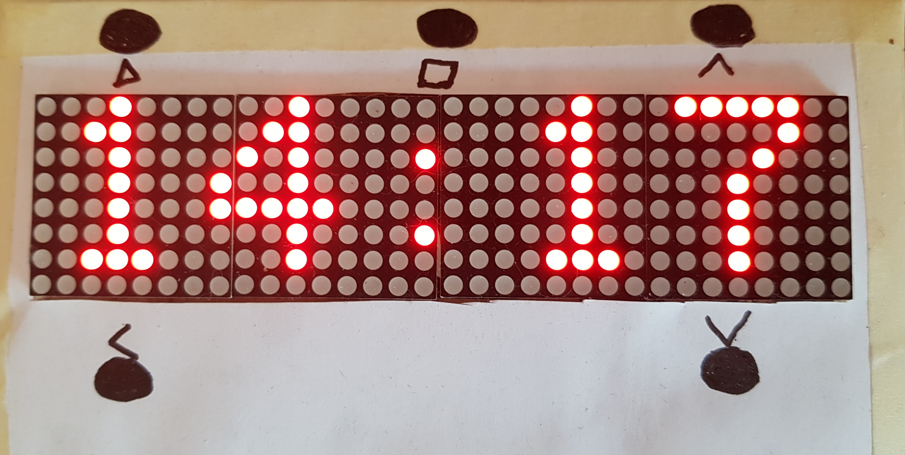

# Matrix-Clock
This is an example project designed with the VHDPlus IDE. This project uses a 8x32 LED Dot Matrix and a real time clock to show the time and work as timer.

This project should work as template to implement your own additional functions like an audio spectrum analyzer together with the clock functionality. To do that set LED_Matrix_Panel_Bitmap to your own matrix, like in the first lines of the Clock_Controller process.

## Software
- Download the VHDPlus IDE from VHDPlus.com and follow the instructions from Get Started.
- Clone this Project and open the Matrix_Clock.vhdpproj file with the IDE. 
- Press the run button, select your FPGA, connect the signals with the I/Os you want to connect your hardware with and click on Compile
- Press the program button and load the created programming file on your FPGA

## Hardware
### LED Matrix
I used an 8x32 LED Dot Matrix with MAX7219 drivers. With the LED_Matrix component you can set the matrix and with LED_Matrix_Text you can create the matrix out of a string.
Use Matrix_CS/CLK/DIN to connect the Matrix. Important: The LED Matrix runs with 5V so use a level shifter to send the data.

### Real Time Clock
I used a DS3231 real time clock to get the current time. Check the real time clock example to see how to set the current time.
Use SDA and SCL to connect the clock.

### Buzzer
For the timer functionality I added a passive buzzer that is driven by the Frequency_Divider that creates a 2038Hz square wave (C7).

### Buttons
To control the timer there are 5 inputs for buttons.
